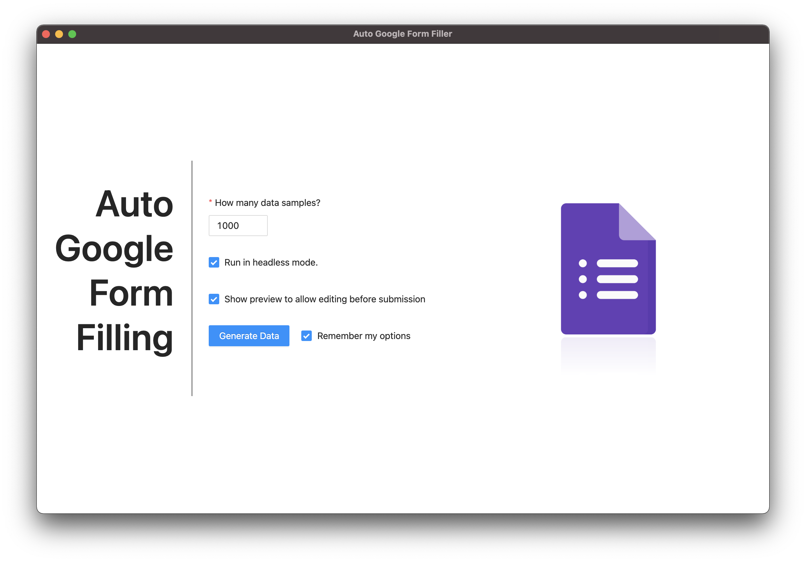
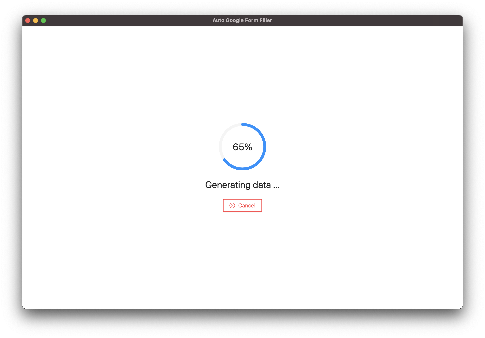
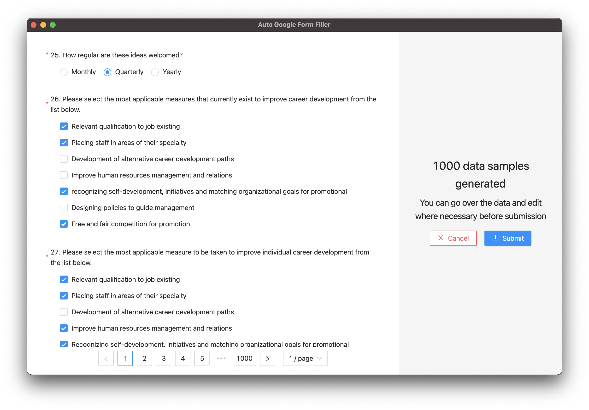
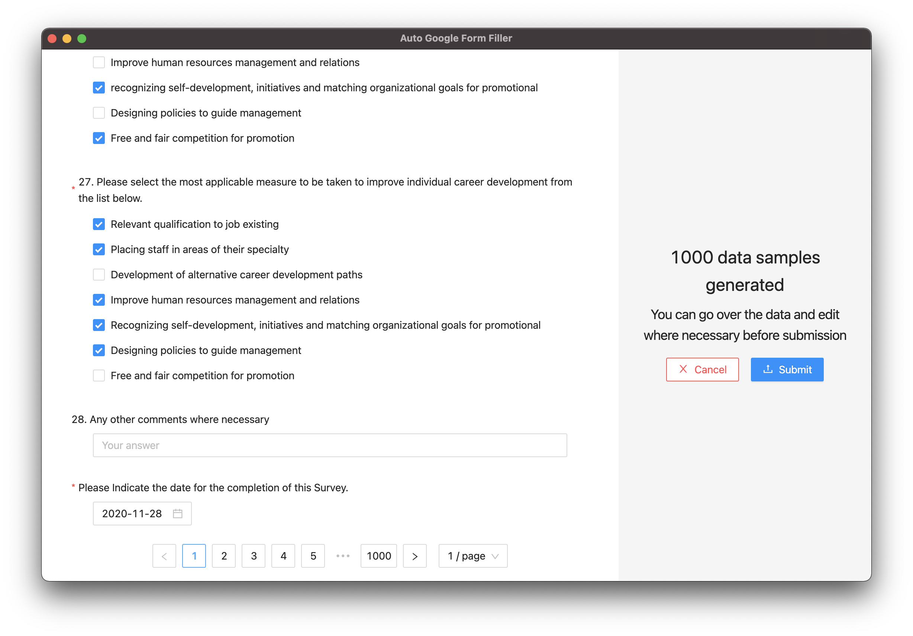
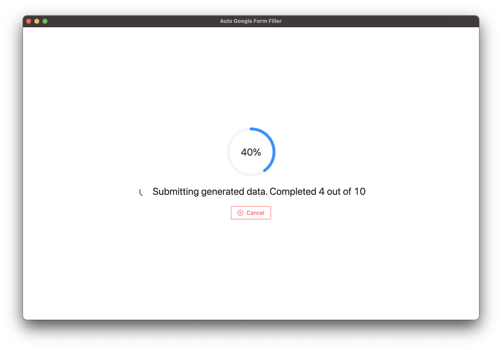
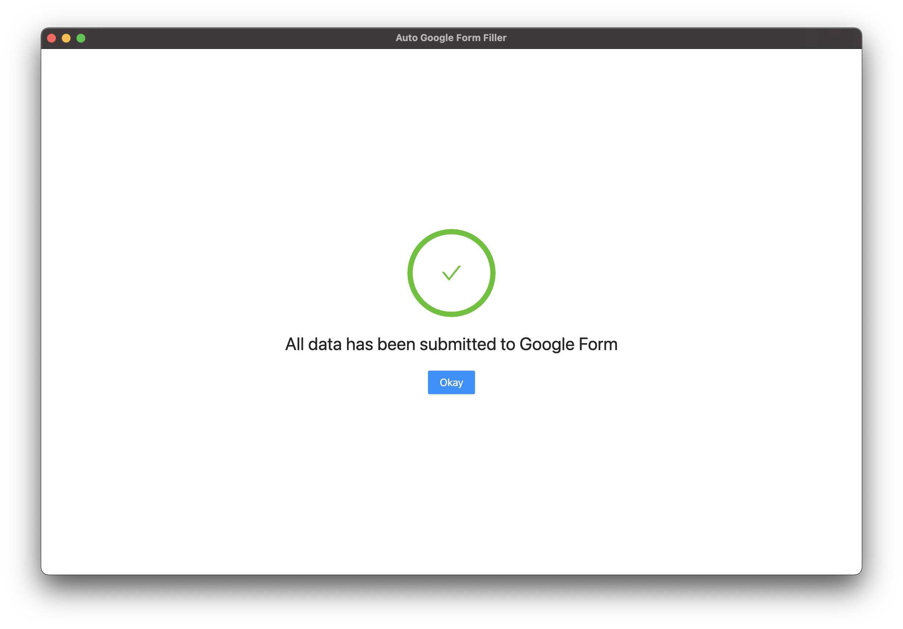

# Auto-Google-Form-Filling

A very simple desktop application for automatically filling (and/or generating data for) a
google form.

Basically, this application generates random data and uses a selenium driver to input data into a google form and submit.

At the moment, it is built for specific google form; support for generic google forms is coming soon.

## Features

- [x] Generate data for google form

- [x] Specify number of data samples to be generated

- [x] Preview generated data before submission

- [x] Pre-edit generated data before submission

- [x] Auto-fill google form and submit

- [x] Run in headless mode

- [ ] Concurrent submission of multiple forms

- [ ] Use custom Google Form url

## Screenshots








## Starting Development

<hr />

This project was bootstrapped from:


<br>

<p>
  Electron React Boilerplate uses <a href="https://electron.atom.io/">Electron</a>, <a href="https://facebook.github.io/react/">React</a>, <a href="https://github.com/reactjs/redux">Redux</a>, <a href="https://github.com/reactjs/react-router">React Router</a>, <a href="https://webpack.github.io/docs/">Webpack</a> and <a href="https://github.com/gaearon/react-hot-loader">React Hot Loader</a> for rapid application development (HMR).
</p>

<hr />

<div align="center">

[![Build Status][github-actions-status]][github-actions-url]
[![Github Tag][github-tag-image]][github-tag-url]

</div>

The project has been set up to make best use of the features in VSCode.
It is recommended to use same for development.

Start the app in the `dev` mode. This starts the renderer process in [**hot-module-replacement**](https://webpack.js.org/guides/hmr-react/) mode and starts a webpack dev server that sends hot updates to the renderer process:

```bash
yarn start
```

## Debugging

1. Make sure all instances of app in dev mode are closed and no shell processes are running.

2. From the debug configuration drop-down in VSCode, select **`Electron: All`**.

   This will start the renderer process with remote debugging enabled, and the main process with inspector debugging enabled.

3. Follow the usual VSCode debugging steps. Set breakpoints, step over, step into, etc

## Packaging for Production

To package apps for the local platform:

```bash
yarn package [--platform] [--target]
```

See [the docs](https://electron-react-boilerplate.js.org/docs/packaging) for more info about packaging.

The supported `platforms` and `targets` are defined in `package.json` as the `build` key. Go to [electron-builder docs](https://www.electron.build/configuration/configuration) for more info on available configurations.

## Development Docs

See Electron React Boilerplate's [docs and guides here](https://electron-react-boilerplate.js.org/docs/installation) for more info.

## Maintainers

- [Prince Odame](https://princeodame.com)

## License

MIT © [Prince Odame](https://github.com/Odame)

[github-actions-status]: https://github.com/electron-react-boilerplate/electron-react-boilerplate/workflows/Test/badge.svg
[github-actions-url]: https://github.com/electron-react-boilerplate/electron-react-boilerplate/actions
[github-tag-image]: https://img.shields.io/github/tag/electron-react-boilerplate/electron-react-boilerplate.svg?label=version
[github-tag-url]: https://github.com/electron-react-boilerplate/electron-react-boilerplate/releases/latest
